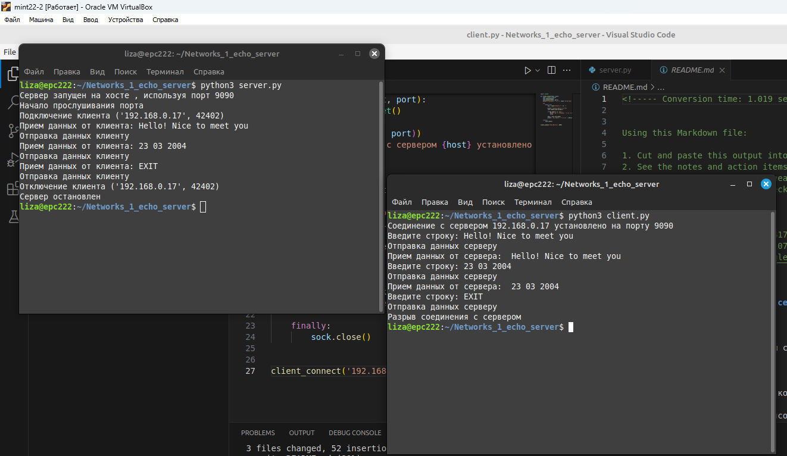
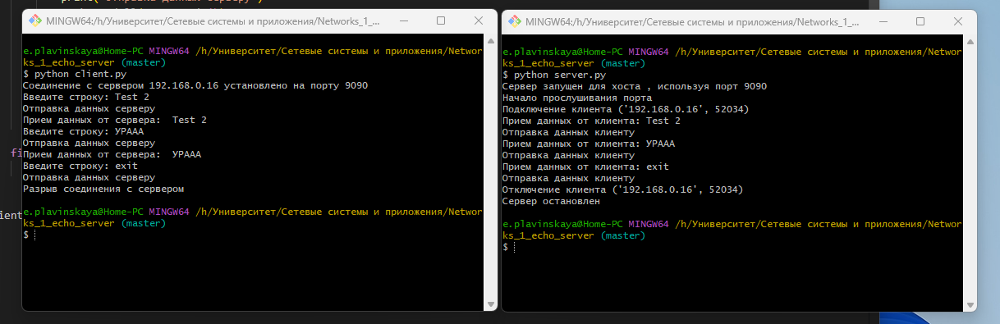
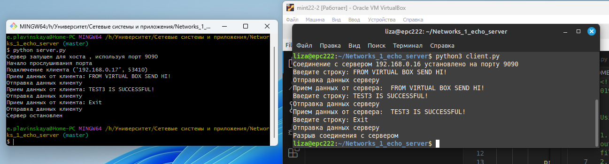
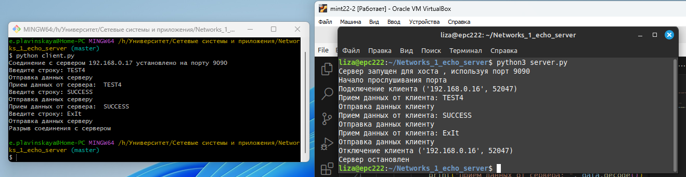

<!----- Conversion time: 1.019 seconds.

Using this Markdown file:

1. Cut and paste this output into your source file.
2. See the notes and action items below regarding this conversion run.
3. Check the rendered output (headings, lists, code blocks, tables) for proper
   formatting and use a linkchecker before you publish this page.

Conversion notes:

* Docs to Markdown version 1.0β17
* Wed Sep 18 2019 01:22:59 GMT-0700 (PDT)
* Source doc: https://docs.google.com/open?id=13Bwj-zrzPHWxDyeuZUzSwTNSqtZj9FI-spwD9tnhUTA
----->

## Простейшие TCP-клиент и эхо-сервер

### Цель работы

Познакомиться с приемами работы с сетевыми сокетами в языке программирования Python.

### Задания для выполнения

1. Создать простой TCP-сервер, который принимает от клиента строку (порциями по 1 КБ) и возвращает ее. (Эхо-сервер).
2. Сервер должен выводить в консоль служебные сообщения (с пояснениями) при наступлении любых событий:
    1. Запуск сервера;
    2. Начало прослушивания порта;
    3. Подключение клиента;
    4. Прием данных от клиента;
    5. Отправка данных клиенту;
    6. Отключение клиента;
    7. Остановка сервера.
3. Напишите простой TCP-клиент, который устанавливает соединение с сервером, считывает строку со стандартного ввода и посылает его серверу.
4. Клиент должен выводить в консоль служебные сообщения (с пояснениями) при наступлении любых событий:
    1. Соединение с сервером;
    2. Разрыв соединения с сервером;
    3. Отправка данных серверу;
    4. Прием данных от сервера.

### Задания для самостоятельного выполнения

1. Проверьте возможность подключения к серверу с локальной, виртуальной и удаленной машины. 
2. Модифицируйте код сервера таким образом, чтобы он читал строки в цикле до тех пор, пока клиент не введет “exit”. Можно считать, что это команда разрыва соединения со стороны клиента.

### Результат: 
#### Все пункты задания были выполнены:

1) Запуск сервера и клиента на виртуальной машине

2) Запуск сервера и клиента на локальной машине

3) Запуск сервера на локальной машине, а клиента на удаленной

4) Запуск сервера на удаленной машине, а клиента на локальной

<!-- Docs to Markdown version 1.0β17 -->
